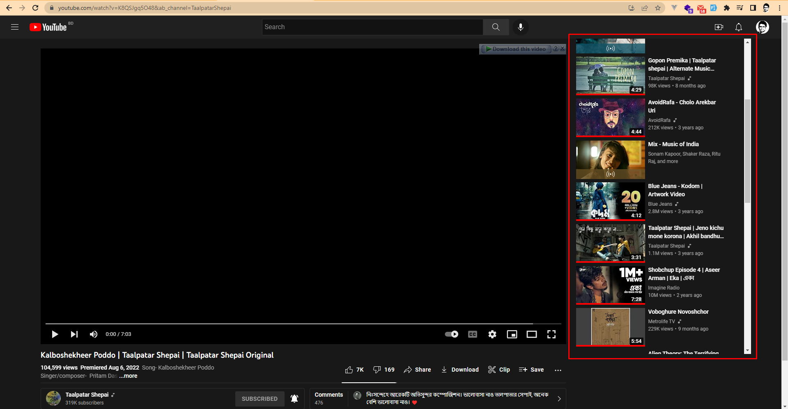

# YouTube Scrollable Playlist - Chrome Extension
> This extension allows you to scroll through YouTube playlist having a fixed player. That means you can scroll through playlist and player will remain fixed as it is.  

## Instruction:
- Download the latest release from [here](https://github.com/AfzalSabbir/YouTubeScrollablePlaylist/releases/tag/v1.0.0)
- Unzip the downloaded file
- Visit: `chrome://extensions/`
- Enable Developer mode `==o`
- Click `[Load unpacked]` button
- Select extracted folder `YouTubeScrollablePlaylist-1.0.0`
- Extension: "YouTube Scrollable Playlist" should be listed
- You can always **disable** this from extension details

## Screenshots:

